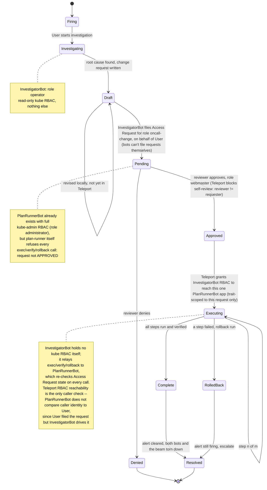

# oncall: change requests as an agent's only tools (Teleport Beams hackathon)

An on-call TUI on your laptop. Alerts come from Alertmanager. Investigating an alert
spins up a **read-only beam** running a pi agent that diagnoses with kubectl and drafts
a **change request** (steps with run / rollback / verify). The change request is filed as a Teleport
**Access Request**. An **executor beam** holding a per-change-request bot identity runs a bespoke MCP
server scoped to that one change request: four tools (`status`, `exec`, `verify`, `rollback`), and every
call is checked against the request's approval and the change's execution state. The
investigator owns that executor and drives it, one operation at a time, when the operator
asks. Everything is in the Teleport audit log. Built entirely on shipped Teleport (18.11,
tenant `flat-pine.beams.sh`). See `PLAN.md` for the why and the findings.

```
laptop: oncall (TUI)                    beams                                             Teleport
  [1] Alerts        ── i ──▶  investigation beam: read-only bot + pi agent + kubectl    ──▶ kube.request (read) as bot-cr-inv-*
  [2] Investigations── s ──▶  1. executor beam: per-change-request bot + plan-runner (MCP over HTTPS app)
                              2. change request filed as Access Request (reason = change-request YAML + executor: bot/beam/app) ──▶ access_request.create
  [3] Change Requests  a ──▶  reviewer approves that executor                            ──▶ access_request.review
  [2] Investigations n v b ▶  investigator calls exec / verify / rollback on its executor  ──▶ app.session.* (beam → plan-runner), kube.request (write) as bot-administrator-*
                     x ────▶  teardown: executor (beam, bot, token) then investigator (beam, bot); the Access Request stays
```

Demo target: **E-mail Pals** on an EKS cluster enrolled in the tenant: `emailpals-web` (the site from
github.com/alexhemard/email-pals, also published through Teleport as app `emailpals-web`) and
`emailpals-api`, namespace `emailpals`. The page polls the API through nginx (`/api/`) every 3s and
shows `emailpals: online`, or an under-construction gif with a flashing SYSTEM IS DOWN banner when the
API has no pods. `demo/break.sh` pushes a bad image to the api: the banner appears within seconds and
the `EmailpalsApiUnavailable` rule fires in about a minute.

**Revisions are proposals.** The investigator writes the first draft straight away. Any later change it
wants to make is shown as YAML in the conversation and written only after you answer yes (**p** `yes`,
or type in the tmux tab); the Investigations row says "revision proposed" while it waits.

## Vocabulary

- **Draft**: the change request as a file, `cr.yaml` in the investigator's beam (pulled to `~/.oncall/draft-*.yaml`). Editable, revisable, not yet in Teleport.
- **Change request**: the draft once *filed*: a Teleport **Access Request** for the `oncall-change` role whose reason carries the change-request YAML plus the `executor:` block. There is no separate resource; the Access Request is the change request, and its state (PENDING, APPROVED, DENIED) is Teleport's.
- **Executor**: the beam, per-change bot and published app registered for that request before it is filed; its progress (READY, IN PROGRESS, COMPLETE…) is the executor's, not Teleport's. The investigator that registered it owns it and is the one that calls it.
- **Torn down**: the investigation's beams and bots are gone (executor and investigator). The Access Request remains as the approval record, the audit log as the record of what ran.

## Access flow

Four identities, each with exactly the access its job needs — nothing is a standing superuser:

- **You** (laptop, full `tsh login`): the TUI runs here. Role `operator` — may file change requests
  and has read-only Kubernetes access to the demo cluster (alerts, status). Runs no agents; a client only.
  Access Requests are always filed as you: Teleport bots cannot file Access Requests at all (confirmed
  live — "can not request role", independent of what roles the bot holds), so the investigator files on
  the beam's own (your) identity even though it drives the result.
- **Investigation bot** (`cr-inv-<id>`, one per investigation): role `operator` too (same read-only
  kube/audit access) plus `investigator-executor-access`, which grants nothing until the change request
  it's acting on is approved.
- **Executor bot** (`administrator-<run>`, one per change request): role `administrator` — full
  kube-admin access to the demo cluster. Minted the moment the investigator *registers* the executor,
  before approval; its Teleport privilege is standing from creation, not elevated by approval. Two
  separate gates apply afterward: `plan-runner` itself re-checks the Access Request's APPROVED state on
  every `exec`/`verify`/`rollback` call, and Teleport RBAC (`investigator-executor-access`) decides
  whether the caller can even open a session to this app in the first place.
- **Reviewer** (`cr-reviewer`, role `webmaster`, a separate human user): may approve/deny the
  `oncall-change` Access Request. Self-review is Teleport-native and always refused here, since the
  reviewer is never the requester.

Request lifecycle, alert to resolution:



Two separate mechanisms do the gating, deliberately not one: `plan-runner`'s own check decides whether an
*approved* request's steps may run right now (re-run on every call — not approved, wrong phase, out of
order all get refused); Teleport RBAC decides whether the caller can *reach the app* at all. They're
intentionally not reconciled against each other — `plan-runner` doesn't compare caller identity to the
request's user, because the request is always filed as `User` (Teleport bots can't file Access Requests)
while `InvestigatorBot` is what actually drives it. The RBAC grant is what's scoped per request instead:
Teleport won't let `InvestigatorBot` open a session to any app until the `investigator-executor-access`
trait names this one specifically, which only happens after approval and only for this one executor's
beam. Tearing down the investigation (removing the bot) revokes it outright, not just on next renewal.

## Layout

| Path | What |
|---|---|
| `cli/oncall.ts` | `oncall` (TUI) plus subcommands for scripting: `investigate`, `submit`, `status`, `deploy`, `run`, `exec`, `verify`, `rollback`, `exec-status`, `teardown`. |
| `cli/tui.ts` | pi-tui screen: Alerts / Investigations (drives execution) / Change Requests (approve, deny) panes, live log. Keys are computed from state (`actionsFor`). |
| `cli/ops.ts`, `cli/investigate.ts`, `cli/beamops.ts` | The actions, and the beam/bot plumbing (bots, bound-keypair tokens, `tsh beams add/exec/scp/publish`). |
| `investigator/` | The investigation agent (pi-agent-core; read-only kubectl tool; `submit_change_request`; HTTP API for the TUI), its in-beam bootstrap, the tmux runner, a mock kubectl for testing without a cluster. |
| `cli/appproxy.ts` | Pooled `tsh proxy app` connections to published beam apps (the investigator's API). |
| `plan-runner/` | The executor: MCP over streamable HTTP, approval gate polling the Access Request, phase state machine, command exec, in-beam `bootstrap.sh`. |
| `investigator/prompt.md` | The investigator's system prompt, in Markdown: how to investigate, the change-request format, how to work with the operator. Edit freely; copied into the beam per investigation. |
| `runbooks/` | Markdown runbooks fed to the investigator by alert name (`{{runbook}}` in the prompt). |
| `shared/` | Change-request schema (zod), YAML/argv parsing, tsh/tctl helpers, Alertmanager reader. |
| `terraform/` | Roles (`operator` — also used by investigation bots, `oncall-change`, `webmaster`, `administrator` — also used by the cluster-setup bot), reviewer user, kube-agent join token. |
| `k8s/`, `demo/` | E-mail Pals deployments (`emailpals-web` served from ConfigMaps of `k8s/emailpals-web/site`, `emailpals-api`), RBAC, alert rule; `kubeup.sh`, `break.sh`, `reset.sh`, `lib-teleport-admin.sh`, `approve.sh`, `bootstrap-beam.sh`; sample alert; local smoke change requests. |

## Setup (once)

```sh
tsh login --proxy=flat-pine.beams.sh:443 --user=alex.hemard@goteleport.com
npm install
export AWS_PROFILE=...                       # or AWS_ACCESS_KEY_ID/SECRET/SESSION_TOKEN; real billable AWS resources
(cd terraform && eval "$(tctl terraform env)" && terraform init && terraform apply)
tctl users reset webmaster                 # reviewer's password + MFA via the link
# one-time, from an AWS CloudShell VPC environment (terraform output bootstrap_kube_agent_cloudshell
# has the values to pick): upload/run terraform/bootstrap-kube-agent.sh — installs the kube agent +
# RBAC with no public endpoint exposure. See terraform/README.md.
demo/kubeup.sh                           # kube-prometheus-stack + emailpals-api/web + publishes emailpals-web, all through Teleport
```

Running the TUI from inside a beam instead of your laptop: sync this repo into the beam, then
`demo/bootstrap-beam.sh` (installs `kubectl` if missing, `tsh kube login`, `npm install`), then
`npx tsx cli/oncall.ts`. Alertmanager access needs nothing beam-specific — see
`demo/bootstrap-beam.sh`'s header comment.

## Demo

```sh
demo/break.sh            # bad image tag -> EmailpalsApiUnavailable in ~1 minute
npx tsx cli/oncall.ts    # the TUI
```

In the TUI: select the alert, **i** to investigate (watch live, or attach with the
printed `tsh beams ssh …` + `tmux attach -t investigate`) → in Investigations, **t** / **c** / **l**
show the transcript, the draft, or the log; **s** submits: this first registers the executor (beam, per-change-request bot, plan-runner
published as an app) and then files the Access Request whose reason is the change request plus an
`executor:` block naming that bot, beam and app. The reviewer approves a concrete, registered
executor: in Change Requests, **a** approves / **d** denies (that tab stands in for a Teleport
Access Request UI and does nothing else). Back in Investigations, the row now shows an
`executor:` block with the state the executor reports (READY, IN PROGRESS n/m, RUNNING step,
COMPLETE, FAILED…), its beam / bot / app, who drives it, and the last command it ran. **n** asks
the investigator to execute the next step, **v** to verify, **b** to roll back, **r** to run to
completion; the investigator calls the executor's MCP tools from its beam and narrates in its
transcript. **x** tears the investigation down: the executor (beam, bot, token, saving its log first), then the
investigator (beam, bot), then the row; each part is reported, and anything already missing is called out.
**R** refreshes; Tab or 1/2/3 switch panes;
**y** copies the selected item.

**Keys follow state.** The help bar lists only what applies to the selection right now, and
nothing else is bound: **s** exists only for an unfiled draft, **n** only while the executor
reports `execute` as valid (approved, not COMPLETE, nothing running), **b** only in FAILED /
COMPLETE / ROLLING BACK, **x** whenever nothing is running. While an
operation is pending with the investigator, or the executor reports a command running, the
operation keys are absent until the executor's status reflects the result. The executor's own API
does not change with state: calling `exec` on a COMPLETE change returns an error saying so.

**Local intent, remote truth.** Submit and every operation record an intent on the investigation
the moment you press the key ("submitting · registering executor", "exec via investigator"), so the
row reflects what you asked for before Teleport or the executor show it. Each remote fetch
reconciles: the intent clears when the request, the bot labels or the executor's command log
reflect it, or after a timeout with a warning. On startup intents are dropped and remote state wins.

**The investigator submits, too.** **s** on an investigation asks the agent to submit: `submit_for_approval`
runs `investigator/submit-cr.sh` inside its beam, which creates the executor beam, the per-change-request bot and
one-time token (`tctl` works in a beam with `--identity $TELEPORT_IDENTITY_FILE --auth-server`), ships one
archive (plan-runner bundle, bootstrap, `cr.yaml`), bootstraps, publishes, files the Access Request — as the
beam's own identity, i.e. the operator (Teleport bots cannot file Access Requests at all, confirmed live:
"can not request role", independent of what roles they hold) — with the `executor:` block, and labels the bot
with the request id, app and `oncall/parent-beam`. The laptop only
watches Teleport: the request and the labeled bot appear on the next refresh and are linked back to the
investigation by that parent label. The agent then attaches the executor's MCP tools as `executor_*`
(`connect_executor`), with the server's own schemas; `executor_exec` etc. return an error until approval.
`oncall submit` remains as the laptop-side path.

**Multi-cluster.** Alerts are fetched from every kube cluster your Teleport identity can see
(`tsh kube ls`), not one fixed cluster — no config required. Each cluster's kube-prometheus-stack
tags its own alerts with a `cluster` label (`prometheus.prometheusSpec.externalLabels.cluster` in
`demo/kubeup.sh`), shown as a `[cluster]` prefix in the Alerts list; investigating an alert routes
that investigation's beam and bot to the alert's own cluster, not a global default. Set
`kube_cluster` in `~/.oncallrc` to pin the TUI to one cluster instead.

**Silencing alerts.** Alertmanager cannot "resolve" an alert Prometheus still fires; the on-call action
is a silence. **m** on an alert posts one (`POST /api/v2/silences` through the kube service proxy, so
it is a `kube.request` by you in the audit log) for `silence_minutes` (default 120) with a comment that
defaults to the linked Access Request id; **M** expires it. Silenced alerts are marked in the list.

**What a verify must do.** It asserts through its exit code. `rollout status --timeout` asserts health;
a value assertion such as `kubectl wait --for=jsonpath='{.spec.template.spec.containers[0].image}'=<tag>`
asserts the change itself. The Kubernetes runbook asks for the value assertion when a step sets a value.
A verify that cannot fail (`get`, `describe`, `logs`), or none at all, is allowed when nothing meaningful
can be asserted; the TUI marks such steps "verify: no-op" so the reviewer sees it.

**Old requests drop off.** Access Requests whose executor was torn down, or that were denied or expired,
more than 30 minutes ago leave the list (`hide_closed_after` in `~/.oncallrc`, 0 keeps everything); **H** shows them again.
The list badge is the Access Request's own state (PENDING, APPROVED, DENIED); the executor's state is in Investigations.

**Approving from the Change Requests tab.** **a** approves and **d** denies as the human reviewer (`webmaster` by
default, `reviewer:` in `~/.oncallrc`) through a second tsh profile (`~/.tsh-reviewer`); you type the
review reason on the bottom line. The first time, the TUI suspends for the reviewer's `tsh login`
(password + MFA). One-time setup: `tctl users reset webmaster` prints the link that sets the password.
`demo/approve.sh` (Machine ID bot reviewer) remains as a shortcut.

**The investigator runs the approved change.** Once the request is APPROVED, **n** / **v** / **b** / **r**
on the investigation send one instruction each to the investigator (over its API, like **p**):
the executor's MCP URL and exactly one operation. The agent calls the executor from inside its beam over
the beam's app access and narrates the result in its transcript; the TUI polls the executor's `status`
until it reflects the operation, then re-enables the keys. The executor has four tools and refuses anything
the state does not allow, so the agent cannot reorder, skip, repeat or invent steps; who may even reach it
at all is Teleport RBAC's job (the investigation bot's `investigator-executor-access` grant, see Access
Flow above), not a caller-identity check inside plan-runner. If the investigator's beam is gone, the laptop calls the executor directly
and the executor block says `driver: laptop (investigator gone)`.

**The investigator is a service.** The agent serves a small HTTP API on its beam, published as a Teleport
app the same way the executor is (`tsh beams publish`; the app name is on the investigator bot's
`oncall/app` label). Teleport injects the caller's JWT on every request and the agent answers only the beam
owner. `GET /state` is the investigation's state (busy, revision, draft YAML, pending proposal, conclusion,
filed request and executor URL, submit progress, text in progress); `GET /events?since=N` is the structured
transcript (assistant text, operator messages, tool calls and results, notes); `POST /message` is **p** and
the **n** / **v** / **b** / **r** / **s** instructions; `PUT /draft` is **e**. The TUI keeps one
`tsh proxy app` per investigator (`cli/appproxy.ts`, pooled) and polls the selected one every 5s, others
while they have work outstanding. No marker parsing, no terminal scraping: the agent's state is the state.

**The draft is a file, and the investigation is a conversation.** The investigator writes the change request to
`/home/beams/investigate/cr.yaml` in its beam and then stays alive; `/state` carries the file, and the
TUI mirrors it to `~/.oncall/draft-*.yaml`. In Investigations: **p** sends a message to the investigator
("check the ConfigMap too", "make step 2 also scale to 2"); its reply streams into the transcript and any
revised change request replaces the file. **A** attaches to the agent's tmux window, where you can type directly.
**e** opens the draft in your editor (TUI suspended), validates it, and sends it to the agent so it reads
your version before its next turn. **s** submits the agent's current file; a filed change request is immutable. Preferences live in
`~/.oncallrc` (YAML, see `.oncallrc.example`): `editor`, `attach` (tab | window | terminal | print),
`proxy`, `kube_cluster`, `refresh_every`, `target`. Environment variables still win.

The right panel shows the selected item. Switching panes follows
the selection (alert → its investigation → its change request, and back), and everything
refreshes every 20s and after each action. The selected investigation's executor is polled in the
background (every 5s while an operation is pending) and its state shown in the `executor:` block:
WAITING FOR APPROVAL → READY (approved, nothing run yet) → IN PROGRESS n/m → RUNNING step.kind (a command
is executing) → COMPLETE, or FAILED → ROLLING BACK → ROLLED BACK, ABORTED; TORN DOWN once **x** removed it,
GONE if its beam vanished. The Access Request's state (PENDING / APPROVED / DENIED) is shown next to it, as
Teleport's. An executor whose investigation row is missing (filed from the CLI, or a lost `~/.oncall`) gets a
row marked "investigator gone" so it can still be torn down.

**What completes a change request.** The change request carries an `alert:` block (name + Alertmanager
fingerprint) written by the investigator, so the TUI can say whether the alert it answers is
still firing. A change request is done when the executor reports COMPLETE (every step ran and verified),
the alert has resolved, and the operator tears the investigation down: **x** removes the executor's beam, bot and token,
which revokes the escalated identity. The Access Request stays as the approval record; the
bot's actions are the audit record. Teleport itself has no completion state for a request.

Order matters: the request can only be approved for an executor that already exists, and
plan-runner only honors a request whose steps are byte-identical to the ones it was deployed with.
A replaced executor means a new request.

Approval must come from a second identity (self-review is refused, and `tctl requests approve`
needs an `access_request:update` rule that `editor` lacks). Either the reviewer user, in another
profile: `TELEPORT_HOME=~/.tsh-reviewer tsh --proxy flat-pine.beams.sh:443 request review --approve <id>`
(one-time `tctl users reset webmaster`), or the demo shortcut `demo/approve.sh [<id>]`: it shows the
queue with `tctl requests ls`, the request with `tctl requests get` (plus the change request unescaped), asks y/N,
then mints a short-lived identity for the Machine ID bot `webmaster-bot` (role `webmaster`) and
reviews with `tsh request review`. `--deny` denies, `-y` skips the prompt.

**How a beam is set up.** Each beam gets one archive: the files it needs, staged under their target
paths and extracted at `/home/beams` (`init-<name>.tgz` stays in `~/.oncall` as the record of that initial
state). For an investigation that is the agent bundle, `prompt.md`, the runbooks, the alert, the scripts
and your terminfo; for an executor, the plan-runner bundle, its bootstrap and the change-request file. Then one script
runs per phase.

**The investigation is a recorded Teleport session.** The agent prints its whole conversation, including
messages that arrive over the API (`[operator] …`), to a tmux window, and the TUI keeps one interactive
`tsh beams ssh <beam>` attached to it for the whole investigation (a pty from `script`, sized 200x50 so
nothing is cropped; the beam's tmux follows the most recent client, so your own attach is never shrunk by
it). tmux is only this: the recordable, attachable copy of the transcript. Everything the
agent prints, and everything said to it, is then a session recording: `tsh play <sid>`, the Web UI
player, and, with the `inference_policy` in `teleport/inference_policy.yaml` (kind ssh → the tenant's
`teleport-cloud-default` model), a Teleport session summary. `q` and **x** end the recording cleanly. The
executor is an HTTP app, not a session, so `oncall close` writes its own `~/.oncall/<id>.summary.md` from the
executor's log: identity, window, each command with exit code and duration, RBAC denials, audit pointers.

**Attaching to an investigation.** `tsh beams ssh <beam>` is the whole command: the beam's
shell attaches interactive SSH sessions to the tmux session itself (detach with prefix-d). This is set
up by `investigator/prepare-beam.sh` in the first seconds after the beam exists, so attaching during
bootstrap waits for the investigator to start instead of dropping to a shell.
In the TUI, **A** (or Enter on an investigation) opens that in a new terminal tab. Ghostty has
no CLI for tabs on macOS, so the tab is driven by AppleScript keystrokes, which needs
Accessibility permission for Ghostty once (System Settings → Privacy & Security → Accessibility);
until then it falls back to a new Ghostty window via `open -na Ghostty.app --args -e`.
`ONCALL_ATTACH=tab|window|terminal|print` overrides. Ghostty's TERM (`xterm-ghostty`) is unknown
to the beam image, so the setup ships your local `infocmp -x $TERM` into the beam and compiles it
with `tic -x` into `~/.terminfo`; tmux then works with your TERM as is.

Same thing step by step from the shell:

```sh
npx tsx cli/oncall.ts investigate demo/alert-crashloop.json        # -> ~/.oncall/draft-*.yaml, beam kept for tmux attach
npx tsx cli/oncall.ts submit ~/.oncall/draft-KubePodCrashLooping-xxxx.yaml   # registers the executor, THEN files the request
npx tsx cli/oncall.ts exec-status <id>                              # approved=false, available=[]
npx tsx cli/oncall.ts exec <id>                                     # error: not approved: access request … is PENDING
# reviewer approves <id>
npx tsx cli/oncall.ts exec-status <id>                              # approved=true, available=[execute]
npx tsx cli/oncall.ts exec <id>                                     # one step (run + verify); repeat until COMPLETE
npx tsx cli/oncall.ts verify <id>  /  npx tsx cli/oncall.ts rollback <id>
npx tsx cli/oncall.ts teardown <id>
```

Without a cluster, the same flow works against a canned broken deployment:
`npx tsx cli/oncall.ts --alerts-file demo/alert-crashloop.json --mock-kubectl` (the
executor's kubectl steps will fail on the mock, which exercises the rollback path).

## Local smoke test of the executor (no Teleport)

```sh
npx tsx plan-runner/server.ts --cr dev --insecure-cr-file demo/cr-dev-fail.yaml --insecure-caller-header --allow true,false,echo --auto
# or serve and drive it step by step:
npx tsx plan-runner/server.ts --cr dev --insecure-cr-file demo/cr-dev-ok.yaml --insecure-caller-header --allow true,false,echo &
npx tsx cli/oncall.ts exec dev --url http://127.0.0.1:8080/mcp
```

## What a change request may contain

A change request must result in a change: at least one step's `run` is a state-changing operation
(`set`, `scale`, `patch`, `delete`, `create`, `apply`, `replace`, `label`, `annotate`, `rollout
undo|restart|pause|resume`, `cordon`, `uncordon`, `drain`, `taint`). A step may read when a later step
depends on it (a pre-check, a lookup); a read step has no `rollback`. `rollback` is always a change back
to the previous state and `verify` is always read-only (`rollout status`, `wait`…). A request whose
steps only read is investigation, not a change, and is rejected. The rule is enforced in
`shared/cr.ts` when the agent writes and at submit; **e** only checks the file parses as a change request. When nothing needs changing
(transient, recovered, noise, or no safe fix) the investigator calls `conclude_no_change`; the row
shows "no change needed" with its one-line conclusion, and you can still ask it to reconsider with **p**.

The prompt (`investigator/prompt.md`) is platform-neutral: how to investigate, what a change request is,
how to work with the operator. Platform specifics live in runbooks: `runbooks/_*.md` are general and
always loaded (`_kubernetes.md` here), `runbooks/<alert>.md` is the alert's, `_default.md` the fallback.

## What plan-runner enforces

- Loads the change request from the Access Request through the bot identity (readable while PENDING). The request must be
  APPROVED and unexpired for `exec` / `verify` / `rollback` to do anything; re-checked per call and polled every 10s.
- Caller must present a valid Teleport JWT (`username` claim verified against the proxy JWKS) to get past MCP at all, but plan-runner
  does not additionally check *who* that caller is — the request is filed by the human requester, while the investigation bot is the
  one that actually drives it, and Teleport bots can't file Access Requests themselves (confirmed live: "can not request role",
  independent of role grants). Who can even reach this app is Teleport RBAC's job (`investigator-executor-access`, trait-scoped
  to this one request only — see Access Flow above), not an identity-matching check inside plan-runner.
- A fixed API of four tools, one step at a time, server-owned cursor: `exec` runs the next pending step (then its verify), once and
  in order; `verify` re-runs the last completed step's verify, repeatable; `rollback` undoes the last completed step, in reverse,
  after a failure or deliberately after COMPLETE; `status` reports phase, steps, the running command, the command log and which
  operations would succeed now. No tool takes a step argument (an optional `expect` guard names the step you think is next).
- The tool list never changes. A call the state does not allow (not approved, COMPLETE or terminal, out of order, a command
  still running) returns an error naming the phase and what is valid instead. One command runs at a time; `status` shows it as
  `inflight`.
- Commands are parsed to argv and executed without a shell; `argv[0]` must be allowlisted (`kubectl`), bound to the bot's kubeconfig.

## How investigations and executors are tracked

Beams cannot carry user labels (the service owns them and rejects changes), so the tracking
record is the **bot** that lives in each beam, created as a resource with labels:

```
oncall/role: executor | investigator
oncall/owner: who started it
oncall/beam-alias, oncall/beam-id: the beam the bot runs in
oncall/ref: request id (executor) or alert name (investigator)
oncall/app: the published executor app, added after publish
```

This mirrors how the beam service labels each beam's own system bot. `tctl get bots` plus
`tsh beams ls` rebuilds the whole picture; `~/.oncall/` is only a cache, and the TUI,
`oncall exec-status`, and `oncall teardown` fall back to Teleport when it is missing. Every
Kubernetes write carries the bot name, so an audit event ties back bot → beam → change request → owner.

## What the audit log shows for one change request

Everything below is a native Teleport event; **w** in the TUI opens the Web UI audit log searched for the
executor bot (`/web/cluster/<cluster>/audit?search=administrator-<run>`). In order, for one change request:

| Event | Who | What it proves |
|---|---|---|
| `bot.create` | requester | the on-call minted a dedicated identity `administrator-<run>` for this change |
| `session.start` / `exec` / `sftp` on node `beam-<uuid>` | requester | every bootstrap command and file (`cr.yaml`, plan-runner bundle) sent to the executor beam; node labels carry the beam alias and owner |
| `join_token.bound_keypair.recovery`, `bot.join` (bound_keypair, from the beam's IP), `cert.create` roles `[administrator]` | bot | the identity was bound to that beam once and can't be replayed |
| `access_request.create` (reason = the change-request YAML, incl. `executor:` bot/beam/app) | requester | the plan as filed, naming the executor that will run it |
| `access_request.review` state APPROVED | reviewer | who approved, with reason |
| `app.session.start` app `<beam>-<id4>` | investigation bot | the investigator reached the executor, granted by Teleport RBAC post-approval (each `exec`/`verify`/`rollback` is a request on this session) |
| `kube.request` PATCH/GET on the deployment, user `bot-administrator-<run>`, groups `[webmaster]`, response 200 | bot | the change itself, attributed to the per-change-request identity, with cluster, path, verb and status |
| `bot.delete` | requester | close: the identity is gone |

"Requester" is the operator — Access Requests are always filed as the beam's own (human-equivalent)
identity, since Teleport bots cannot file Access Requests at all. The `app.session.start` for `exec` /
`verify` / `rollback` is still the investigation bot, not the requester: that's expected, and plan-runner
no longer compares the two (see "What plan-runner enforces" below) — Teleport RBAC decides who can reach
the app at all.

Investigations leave the same shape with `cr-inv-*` bots, `kube.request` GETs only, and an
`app.session.start` for the `anthropic` LLM app made by the beam.

Gaps observed (18.11):

- Beam create / publish / delete are not audit events; the beam shows up only as an SSH node with
  `teleport.internal/beams/*` labels.
- **The commands themselves are not in Teleport's log.** The plan is (the request reason), and the effects
  are (`kube.request` PATCH/GET as the bot), but the exact argv plan-runner ran is only in plan-runner's own log.
  `oncall close` copies that log out of the beam to `~/.oncall/<request-id>.exec.log` before the beam is
  removed (JSON lines: request id, step, argv, caller, exit code, duration).
- Teleport's MCP app type would put every tool call in the log as `mcp.session.request` (JSON-RPC method
  and params), so `exec {step}` would be audited by name. It is not usable here for the *server* side:
  `tsh beams publish` only registers HTTP apps, and an App Service elsewhere cannot reach a process inside
  a beam (`mcp+http://` needs a routable URI). The often-quoted "MCP doesn't work in beams" is the *client*
  side (`tsh mcp connect` needs a cert reissue) — this *does* apply here, since the caller is the
  investigator (a bot inside a beam), not the laptop: a bare, unauthenticated request to the executor's
  public app URL gets redirected to Teleport's own login page rather than reaching plan-runner. The
  investigator tunnels through `tsh proxy app` under its own bot identity instead (that identity can
  reissue the app-scoped cert; the beam's own native identity cannot).
- HTTP app sessions record `start`/`chunk` only, and app session recordings could not be streamed back on
  this tenant.
- Nothing links `kube.request` by the bot to the Access Request except the bot name in the request's
  `executor:` block.
- The reviewer in the demo is a bot unless the `webmaster` user's login is completed.

## Known limits (facts, not proposals)

- A beam's own identity cannot reissue certs, so escalated (and read-only) identities are second tbot/bot processes inside the
  beam, the workaround the Beams team recommends. Delegation V2 (core#536, RFD 0329) is the native path.
- MCP-subkind apps are unreachable from beams today; plan-runner is a plain HTTP app serving MCP over HTTPS.
- Writes are attributed to `bot-administrator-<id8>`, correlated to you by name and by the request id in plan-runner's log.
- Access Requests have no completion state; the change request's progress lives in plan-runner (and `~/.oncall/`). Done = executor torn down.
- Alertmanager is read through the Kubernetes API server's service proxy. In Teleport's v8 `kubernetes_resources`
  that path is a distinct verb: `{kind: services, api_group: "", verbs: [get, proxy]}`; plain `get/list/watch` on `*` does not cover it.
- Long-running executor steps (e.g. `rollout status --timeout=90s`) exceed the MCP SDK's default 60s client timeout; the CLI/TUI use 15 minutes.
- A wedged local ssh-agent makes every `tsh` invocation hang at startup (tsh connects to `$SSH_AUTH_SOCK`); `ssh-add -l` refusing is the tell.
- `beamctl` is not usable through `tsh beams exec` on this tenant; long-running processes use tmux / `setsid nohup`.
- `tsh beams exec` needs `--` before dash-prefixed arguments and re-joins arguments with spaces, so remote commands avoid shell quoting.
- The beam's Anthropic proxy maps every model id to `claude-sonnet-5` and rejects legacy `thinking.type: enabled`; the investigator runs with thinking off.
