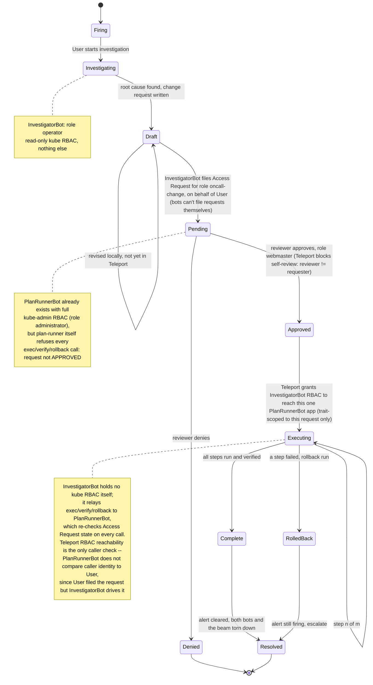

# oncall vibes

on-call agentic response TUI

connects to Alertmanager API via teleport

investigator beams can be launched from alerts using your organization's runbooks

The investigator beam publishes a pi RPC api that the TUI uses to investigate an
issue, propose a change request plan, and uses an audit log query tool to
discover a root cause.

A change request can be submitted, which creates A `plan-runner` beam, that
publishes an MCP server that executes the plan. An access request is created on
behalf of the investigator beam's bot identity and only once approved is its
agent able to execute the plan and remediate the alert.

## Setup

```bash

# aws sso login
# tsh login --proxy <beams tenant>
# eval "$(tctl terraform env)"

cd terraform/
terraform init
terraform apply

# <follow AWS CloudShell bootstrap instructions in terraform output>

./demo/kubeup.sh # run helm install commands
```
## How to run

```
pnpm install
npx oncall
```

## Terraform

The `terraform/` directory creates the following:

- a private EKS cluster that runs the demo website, email pals
- Teleport resources to run the oncall TUI

## Process / Architecture

```
laptop: oncall (TUI)                    beams                                             Teleport
  [1] Alerts        ── i ──▶  investigation beam: read-only bot + pi agent + kubectl    ──▶ kube.request (read) as bot-cr-inv-*
  [2] Investigations── s ──▶  1. executor beam: per-change-request bot + plan-runner (MCP over HTTPS app)
                              2. change request filed as Access Request (reason = change-request YAML + executor: bot/beam/app) ──▶ access_request.create
  [3] Change Requests  a ──▶  reviewer approves that executor                            ──▶ access_request.review
  [2] Investigations n v b ▶  investigator calls exec / verify / rollback on its executor  ──▶ app.session.* (beam → plan-runner), kube.request (write) as bot-administrator-*
                     x ────▶  teardown: executor (beam, bot, token) then investigator (beam, bot); the Access Request stays
```




## Demo

```sh
demo/break.sh            # bad image tag -> EmailpalsApiUnavailable in ~1 minute
npx tsx cli/oncall.ts    # the TUI
```
